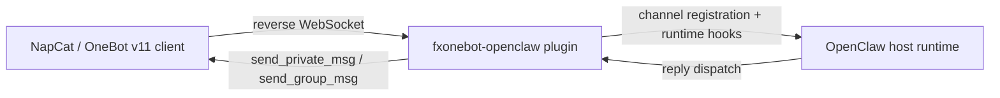

# fxonebot-openclaw

中文 | [English](#english)

一个面向 OpenClaw 的 OneBot v11 插件公开仓库，重点支持 NapCat reverse WebSocket 接入。

## 这是什么

这是一个**纯插件标准仓库**，只包含：

- OneBot 插件源码
- 通用安装说明
- 通用配置示例
- GitHub Actions 上游强校验

它**不是**完整的 OpenClaw monorepo，也不包含你的私有运行环境配置。

## 功能概览

- OneBot v11 reverse WebSocket server
- QQ 私聊接入，支持 `dmPolicy`
- QQ 群聊接入，支持 `groupPolicy + allowFrom + requireMention`
- owner 私聊群授权命令：`grant / revoke / list / reset`
- 自消息过滤、消息去重、显式 `@bot` 检测
- GitHub Actions 中对 upstream OpenClaw 的兼容性校验

## 快速入口

- 文档导航：`docs/README.md`
- 安装说明：`docs/INSTALLATION.md`
- 开发说明：`docs/DEVELOPMENT.md`
- 架构说明：`docs/ARCHITECTURE.md`
- OpenClaw 示例配置：`examples/openclaw.config.example.json`
- NapCat 示例配置：`examples/napcat.websocket_client.example.json`

## 架构简图

## 典型使用方式

1. 将本仓库内容放入上游 OpenClaw 的 `extensions/onebot/`
2. 在 OpenClaw 中启用插件并配置 `channels.onebot`
3. 在 NapCat 中配置 `websocketClients`
4. 重启 OpenClaw 与 NapCat
5. 验证私聊与群聊门禁逻辑

完整步骤见：`docs/INSTALLATION.md`

## 仓库结构

- `index.ts`：插件入口
- `openclaw.plugin.json`：插件清单
- `package.json`：插件包信息
- `src/`：插件源码与 focused tests
- `docs/`：安装与开发文档
- `examples/`：公开安全的占位示例配置
- `scripts/`：上游强校验脚本
- `.github/workflows/ci.yml`：CI 工作流

## CI 说明

本仓库采用 **upstream strong validation**：

- CI 先拉取上游 `openclaw/openclaw`
- 再把本仓库覆盖到 `extensions/onebot/`
- 然后执行 focused tests、build 和 upstream checks

这样仓库可以保持轻量，同时持续验证对上游的真实兼容性。

## 公共仓库原则

为了适合公开发布，本仓库遵循：

- 示例配置全部使用占位符
- 不提交真实 token、内网 IP、QQ 号、owner 标识
- 文档使用通用化描述，不绑定私人运行环境

---

## English

A public standalone OneBot v11 plugin repository for OpenClaw, focused on NapCat reverse WebSocket integration.

## What this repository is

This is a **plugin-only repository**. It contains:

- OneBot plugin source code
- generic installation docs
- generic config examples
- upstream compatibility validation in GitHub Actions

It is **not** a full OpenClaw monorepo and does not contain private runtime configuration.

## Features

- OneBot v11 reverse WebSocket server
- private chat access via configurable `dmPolicy`
- group chat access via `groupPolicy + allowFrom + requireMention`
- owner-only DM commands for group authorization management
- self-message filtering, dedupe, and explicit `@bot` detection
- upstream OpenClaw compatibility validation in CI

## Quick links

- Docs index: `docs/README.md`
- Installation guide: `docs/INSTALLATION.md`
- Development guide: `docs/DEVELOPMENT.md`
- Architecture guide: `docs/ARCHITECTURE.md`
- OpenClaw example config: `examples/openclaw.config.example.json`
- NapCat example config: `examples/napcat.websocket_client.example.json`

## Typical usage

1. Place this repository contents into upstream OpenClaw as `extensions/onebot/`
2. Enable the plugin and configure `channels.onebot`
3. Configure NapCat `websocketClients`
4. Restart OpenClaw and NapCat
5. Validate private-chat and group-gating behavior

See `docs/INSTALLATION.md` for the full setup flow.

## License

MIT - see `LICENSE`
