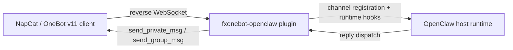

# fxonebot-openclaw

中文 | [English](#english)

一个面向 OpenClaw 的 OneBot v11 插件公开仓库，重点支持 NapCat reverse WebSocket 接入。

## 版本说明

当前公开版本为 **`v0.2.0`**，新增能力：

- **QQ 私聊 typing / 输入中状态**
- typing 失败隔离，不影响流式 reply 和最终 reply

## 兼容目标

当前仓库默认面向 **OpenClaw `2026.3.2` 的 npm / 全局安装形态**。

这意味着本仓库当前使用：

- `openclaw/plugin-sdk`

而不是较新的源码树里出现的：

- `openclaw/plugin-sdk/compat`
- `openclaw/plugin-sdk/core`

原因不是功能差异，而是当前已发布 npm 宿主包的可用导出接口与源码主干存在差异。

## 这是什么

这是一个**纯插件标准仓库**，只包含：

- OneBot 插件源码
- 通用安装说明
- 通用配置示例
- GitHub Actions 校验流程

它**不是**完整的 OpenClaw monorepo，也不包含私有运行环境配置。

## 功能概览

- OneBot v11 reverse WebSocket server
- QQ 私聊接入，支持 `dmPolicy`
- **QQ 私聊 typing / 输入中状态**
- QQ 群聊接入，支持 `groupPolicy + allowFrom + requireMention`
- owner 私聊群授权命令：`grant / revoke / list / reset`
- 自消息过滤、消息去重、显式 `@bot` 检测

## 快速入口

- 文档导航：`docs/README.md`
- 安装说明：`docs/INSTALLATION.md`
- 开发说明：`docs/DEVELOPMENT.md`
- 架构说明：`docs/ARCHITECTURE.md`
- QQ DM typing 方案：`docs/V0_2_0_QQ_DM_TYPING_PLAN.md`
- OpenClaw 示例配置：`examples/openclaw.config.example.json`
- NapCat 示例配置：`examples/napcat.websocket_client.example.json`

## 架构简图

## 典型使用方式

1. 将本仓库内容放入 OpenClaw 的 `extensions/onebot/`
2. 在 OpenClaw 中启用插件并配置 `channels.onebot`
3. 在 NapCat 中配置 `websocketClients`
4. 重启 OpenClaw 与 NapCat
5. 验证私聊与群聊门禁逻辑

完整步骤见：`docs/INSTALLATION.md`

## 仓库结构

- `index.ts`：插件入口
- `openclaw.plugin.json`：插件清单
- `package.json`：插件包信息
- `src/`：插件源码与 focused tests
- `docs/`：安装与开发文档
- `examples/`：公开安全的占位示例配置
- `scripts/`：上游校验辅助脚本
- `.github/workflows/ci.yml`：CI 工作流

## CI 说明

当前公开仓 CI 以 **已发布宿主版本兼容性** 为主：

- 默认校验目标：`openclaw v2026.3.2`
- 运行 focused tests
- 运行 upstream build

这样可以保证仓库对当前实际可安装宿主版本保持可用，而不是只对源码主干成立。

## 公共仓库原则

为了适合公开发布，本仓库遵循：

- 示例配置全部使用占位符
- 不提交真实 token、内网 IP、QQ 号、owner 标识
- 文档使用通用化描述，不绑定私人运行环境

---

## English

A public standalone OneBot v11 plugin repository for OpenClaw, focused on NapCat reverse WebSocket integration.

## Version

Current public version: **`v0.2.0`**

New in this version:

- **QQ private-chat typing indicator**
- failure-isolated typing lifecycle that does not break reply delivery

## Compatibility target

This repository currently targets **OpenClaw `2026.3.2` as released through npm/global installs**.

Because of that, the plugin currently imports from:

- `openclaw/plugin-sdk`

instead of newer source-tree-only subpaths such as:

- `openclaw/plugin-sdk/compat`
- `openclaw/plugin-sdk/core`

## Features

- OneBot v11 reverse WebSocket server
- private chat access via configurable `dmPolicy`
- **QQ private-chat typing indicator**
- group chat access via `groupPolicy + allowFrom + requireMention`
- owner-only DM commands for group authorization management
- self-message filtering, dedupe, and explicit `@bot` detection

## Quick links

- Docs index: `docs/README.md`
- Installation guide: `docs/INSTALLATION.md`
- Development guide: `docs/DEVELOPMENT.md`
- Architecture guide: `docs/ARCHITECTURE.md`
- QQ DM typing plan: `docs/V0_2_0_QQ_DM_TYPING_PLAN.md`
- OpenClaw example config: `examples/openclaw.config.example.json`
- NapCat example config: `examples/napcat.websocket_client.example.json`

## License

MIT - see `LICENSE`
