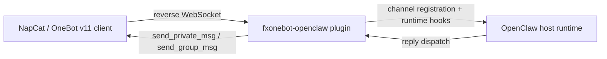

# Architecture

## Overview

This plugin sits between NapCat and OpenClaw.

- NapCat acts as the OneBot v11 reverse WebSocket client
- OpenClaw provides the host runtime and plugin system
- This repository provides the `onebot` channel plugin implementation

## Runtime flow

## Main modules

- `index.ts` - plugin registration entry
- `src/channel.ts` - channel wiring and outbound behavior
- `src/inbound.ts` - inbound parsing, gate checks, owner commands
- `src/ws-server.ts` - reverse WebSocket server and request/response flow
- `src/accounts.ts` - account config resolution
- `src/config-schema.ts` - OneBot config schema

## Validation model

This repository is validated against upstream OpenClaw in CI:

1. clone upstream OpenClaw
2. patch upstream for OneBot plugin SDK routing
3. overlay this plugin as `extensions/onebot/`
4. run focused tests
5. run upstream build and checks

This ensures the repository stays lightweight while still proving real compatibility.
